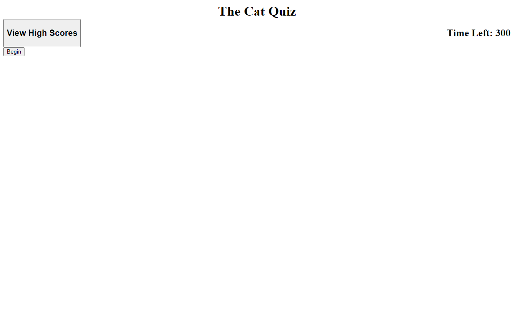
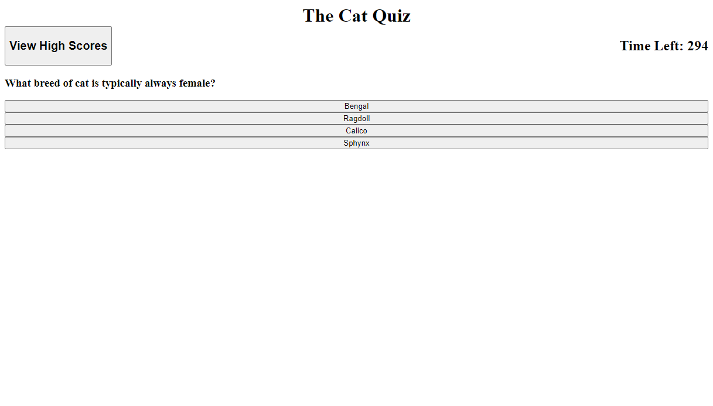
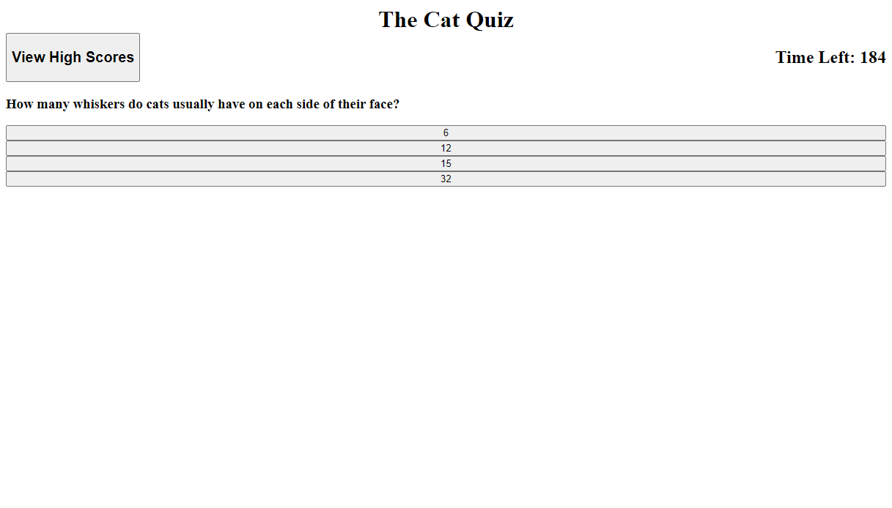
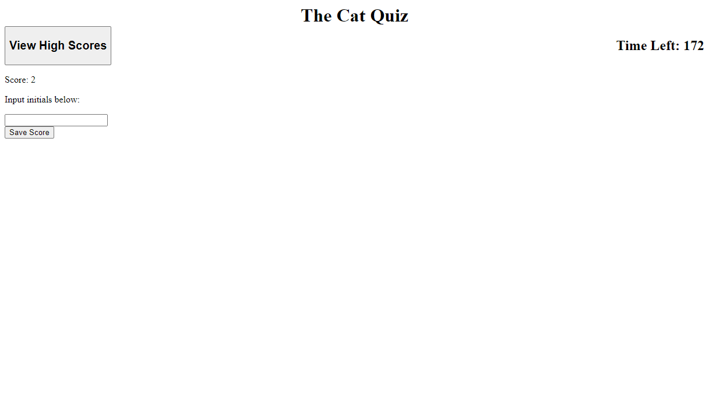
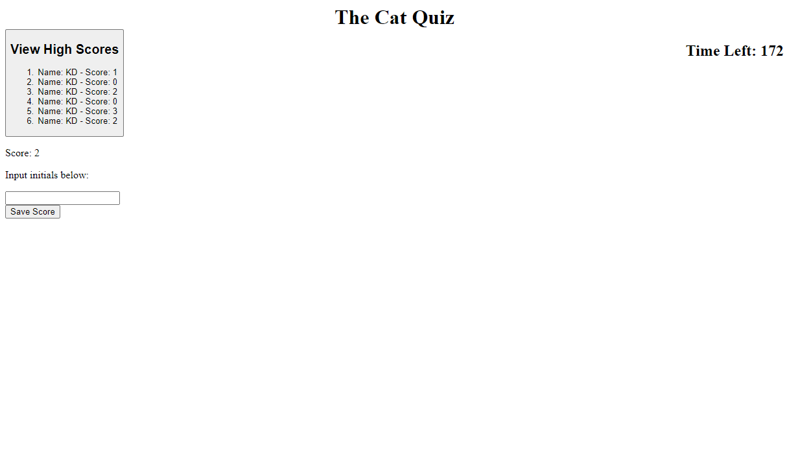

## Timed Cat Quiz

## Description

As a coding student I wanted to be able to practice using a timed quiz application that emulates an interview quiz. This quiz is meant to test your knowledge of random cat facts in 300 seconds.

## Table of Contents

- [Usage](#usage)
- [Credits](#credits)
- [License](#license)

## Usage

To use this quiz, first click the Begin button, then select from the answers presented on the screen based on the question given. If an answer selected is incorrect, 100 seconds will be deducted from the timer. Once the timer reaches zero or all questions have been answered, the quiz will end and the user will be presented with an opportunity to record their score on the high scores list and try again. 

## Screenshot

Example of the main page:

Example of the question display:

Example of time deduction (top right corner):

Example of the prompt to enter score and initals:

Example of the high scores list (top left corner):

## Link

